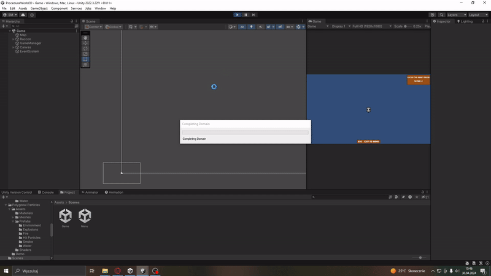

## Project: Procedural Fox World 2D

### Made with C# and Unity Engine

The game I created for a recruitment task involves catching as many foxes as possible in a randomly generated 2D world with a raccoon as the main character. :scroll:

Unity Developer: Szymon Mozol

<table>
<tr>
    <td>

</td>
    <td>

</td>
</tr>
<tr>
    <td>

</td>
    <td>

</td>
</tr>
</table>

<h2 align="center">Download :video_game: </h2>

    Click here to download <a href="https://drive.google.com/file/d/1sSqdge_Yh9IWRyxK-q43_Q0o8ArrTtpz/view?usp=drive_link">Procedural Fox World 2D</a>

